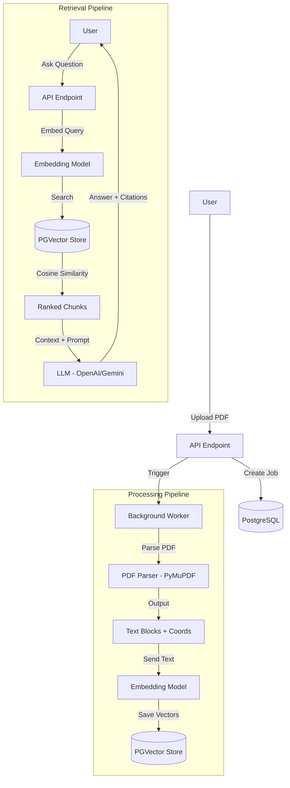
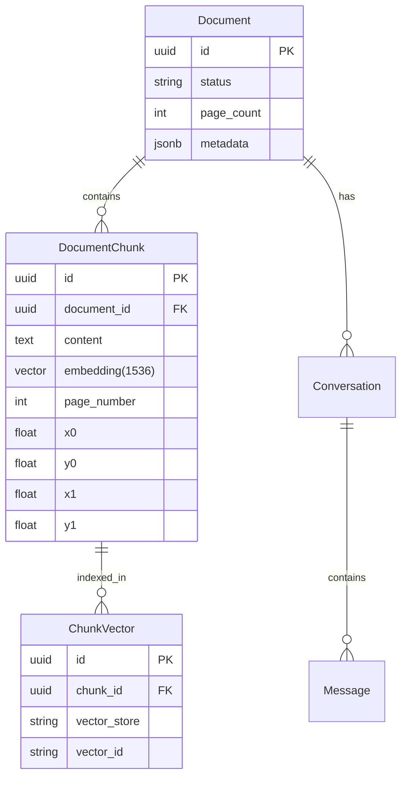

# Architecture & Engineering: PDF RAG System

This document details the mathematical foundations, engineering decisions, and system architecture of the PDF RAG (Retrieval-Augmented Generation) backend.

## 1. System Overview

The system is designed to provide high-precision Q&A over PDF documents. Unlike generic text-splitting approaches, this system is **spatial-aware**, preserving the exact location (bounding boxes and line numbers) of every text segment. This allows the frontend to highlight the exact source of an answer.

### Core Architecture Diagram



---

## 2. Mathematical Foundations

### 2.1 Vector Space Model

The system uses a high-dimensional vector space to represent semantic meaning.

*   **Dimensions ($d$):** 1536 (default for OpenAI `text-embedding-3-small`).
*   **Embedding Function ($f$):** Maps a text string $t$ to a vector $\vec{v} \in \mathbb{R}^d$.
    $$ f(t) = \vec{v} $$
    where $||\vec{v}|| = 1$ (normalized).

### 2.2 Similarity Metric (Cosine Similarity)

To find relevant content, we calculate the similarity between the query vector ($q$) and document chunk vectors ($d_i$). 

Since vectors are normalized, Cosine Similarity is simply the dot product:

$$ \text{similarity}(\vec{q}, \vec{d_i}) = \cos(\theta) = \frac{\vec{q} \cdot \vec{d_i}}{||\vec{q}|| \cdot ||\vec{d_i}||} = \vec{q} \cdot \vec{d_i} $$

In **pgvector**, this is implemented using the `<=>` operator (Cosine Distance), where:
$$ \text{distance} = 1 - \text{similarity} $$
$$ \text{similarity} = 1 - (\vec{q} \Leftrightarrow \vec{d_i}) $$

### 2.3 Retrieval Logic

The retrieval step solves the following optimization problem:

Given a query $q$ and a set of chunks $C = \{c_1, c_2, ..., c_n\}$, find the subset $R \subset C$ of size $k$ such that:

$$ R = \underset{S \subset C, |S|=k}{\arg\max} \sum_{c \in S} \text{similarity}(f(q), f(c)) $$

Practically, this is executed via a `SELECT` query with `ORDER BY embedding <=> query_embedding LIMIT k`.

---

## 3. Engineering Implementation

### 3.1 PDF Parsing & Chunking Strategy

Instead of arbitrary token windows, we use a **Visual Block Strategy**.

1.  **Library:** `PyMuPDF` (fitz).
2.  **Logic:** The PDF is analyzed for visual text blocks (paragraphs, headers) as defined by the PDF structure.
3.  **Preservation:** For every block, we extract:
    *   **Text:** The content.
    *   **Bounding Box:** $(x_0, y_0, x_1, y_1)$ in PDF points.
    *   **Line Numbers:** `line_start` and `line_end` (globally indexed per document).

**Why this matters:**
*   **Context Integrity:** Paragraphs are naturally kept together.
*   **Visual Fidelity:** We can draw a box around exactly what the model "read".

### 3.2 Database Schema (PostgreSQL)

The database handles both relational metadata and vector data.



### 3.3 Asynchronous Processing Pipeline

Processing is decoupled to ensure API responsiveness.

1.  **Job Creation:** `ProcessingService` creates a job record (`status: pending`).
2.  **Worker:** A background task (triggered via queue or direct async call) picks up the job.
3.  **Stages:**
    *   **Parsing:** Extracts `TextBlocks`.
    *   **Indexing:** Loops through blocks, generates embeddings, writes to `document_chunks`.
    *   **Finalizing:** Updates document status to `ready`.

### 3.4 Multi-Provider Support

The system is engineered to be agnostic to the underlying AI providers.

*   **Embeddings:** Configurable (OpenAI, Gemini).
*   **LLM:** Configurable (OpenAI, Gemini).

This is managed via the `RAGEngine` class which acts as a factory/facade over the LlamaIndex abstractions.

---

## 4. Citation & Precision

A key feature is the "Citation" object returned with answers.

When the LLM generates an answer, it is provided with context chunks formatted as:
`[Source: Page 5, Lines 20-25] <content>`

The system then correlates the used context back to the frontend:

1.  **Retrieval:** We get `Chunk` objects from DB.
2.  **Context Construction:** We pass text + metadata to LLM.
3.  **Citation Object:**
    ```json
    {
      "citationId": "cite_123",
      "documentId": "doc_abc",
      "pageNumber": 5,
      "boundingBox": { "x0": 100, "y0": 200, "x1": 500, "y1": 300 },
      "text": "The extracted text..."
    }
    ```

This allows the UI to render a yellow highlight box *exactly* over the source text on the PDF canvas.
