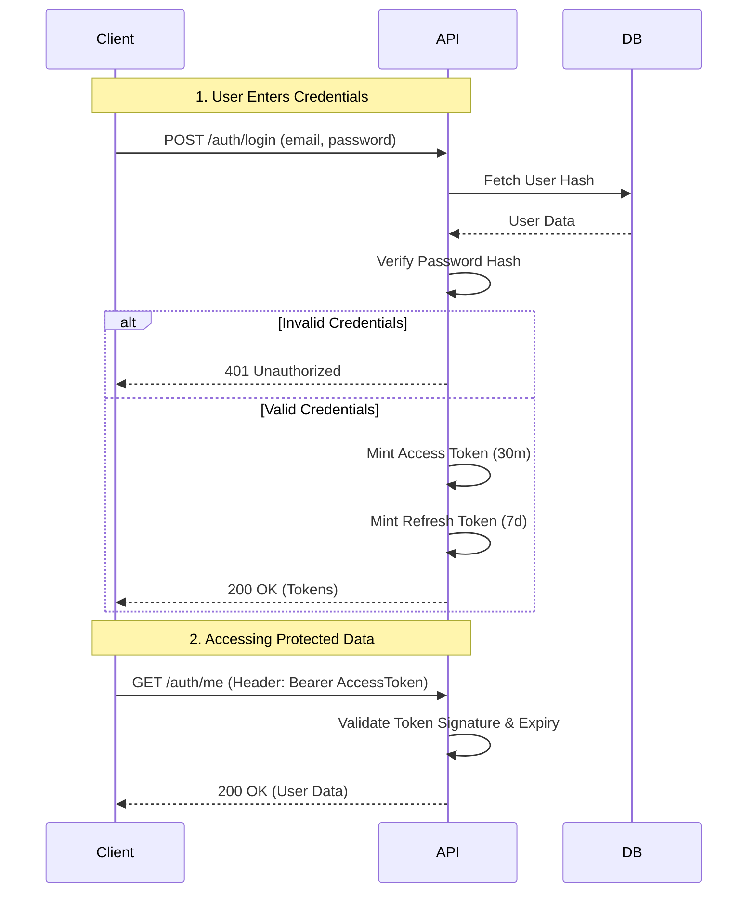
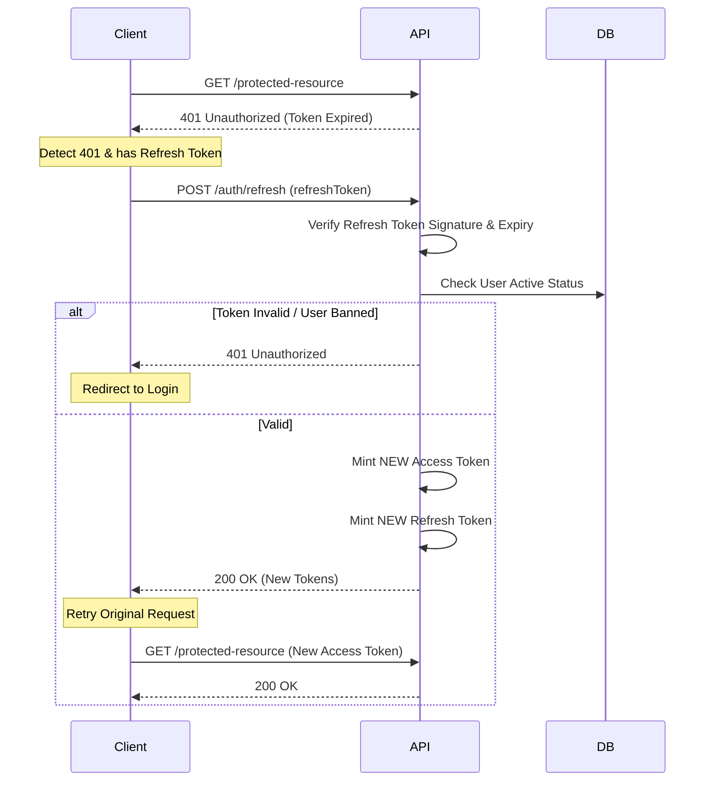

# Authentication Guide

This guide explains how authentication works in the PDF-RAG system. We use a **JWT (JSON Web Token)** based flow with separate **Access** and **Refresh** tokens to balance security and user experience.

## Overview

The system uses a standard OAuth2-style Bearer token implementation.
1.  **Access Token:** Short-lived (e.g., 30 minutes). Used to authorize API requests.
2.  **Refresh Token:** Long-lived (e.g., 7 days). Used to get new access tokens when the old one expires.

## Key Concepts

### 1. Registration vs. Login
- **Registration** (`/register`) creates the record in the database. It does *not* return tokens.
- **Login** (`/login`) validates credentials and mints the tokens.
- *Why?* This separation allows for email verification steps (if added later) before granting access.

### 2. The Token Lifecycle
Clients should store the Refresh Token securely (e.g., `HttpOnly` cookie or secure storage) and the Access Token in memory or a short-term store.

#### Flow Diagram: Login & Access

### 3. Handling Token Expiration

When the **Access Token** expires, the API returns a `401 Unauthorized`. The client should then use the **Refresh Token** to get a new pair without forcing the user to log in again.

#### Flow Diagram: Refreshing Tokens

## Security Implementation Details

- **Hashing:** Passwords are hashed using `bcrypt` via the `passlib` library.
- **JWT Library:** We use `python-jose` for encoding and decoding tokens.
- **Statelessness:** Access tokens are stateless. The server validates them by checking the signature, not by looking up a session in the DB.
- **Revocation:** Refresh tokens check the user's status (`is_active`) in the DB. If a user is banned, their refresh token will stop working, effectively revoking access once the short-lived access token expires.
