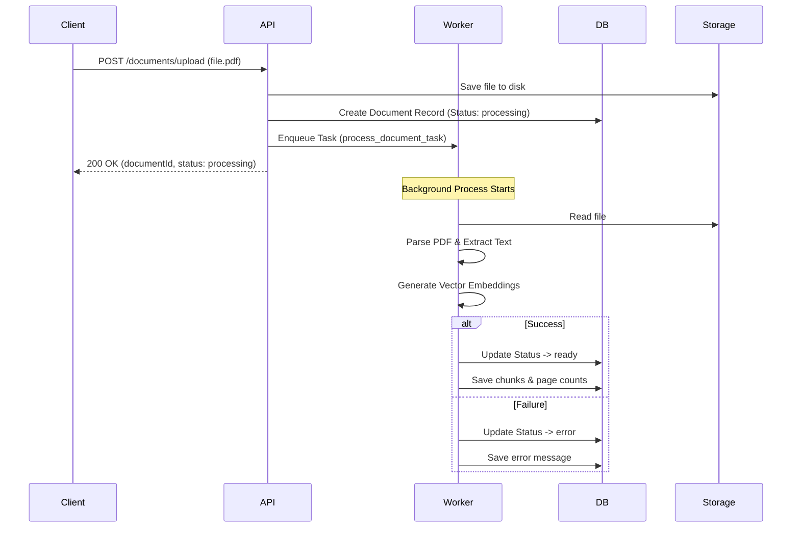
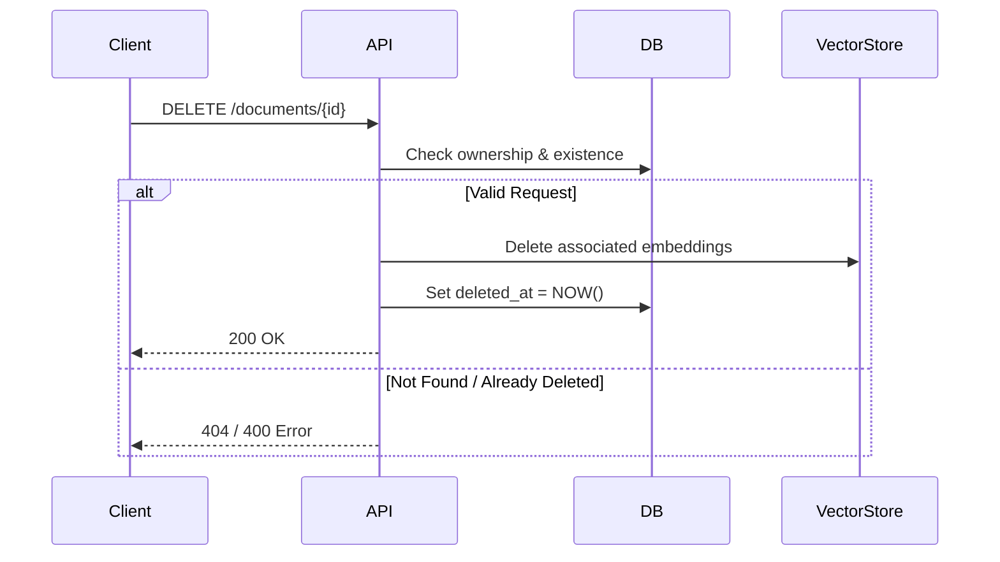

# Document Management Guide

This guide explains the lifecycle of a document within the system, from the initial upload to its eventual deletion.

## Overview

The document system is designed to handle potentially large PDF files without blocking the main API. It uses an **Asynchronous Processing Pipeline** to perform heavy tasks like parsing text and generating vector embeddings in the background.

## Key Concepts

### 1. The Processing Pipeline
When you upload a file, the API immediately saves it to disk and returns a `processing` status. It does *not* wait for the text extraction to finish.

#### Flow Diagram: Document Upload

### 2. Status Lifecycle
A document moves through specific states:
1.  **`uploading`** (Internal state while receiving bytes)
2.  **`processing`** (File saved, background worker is analyzing it)
3.  **`ready`** (Fully indexed and available for chat/search)
4.  **`error`** (Something went wrong; check `errorMessage` for details)

### 3. Soft Deletion
Deleting a document is a "soft" operation.
- The database record is kept but marked with `deleted_at`.
- The document is hidden from list endpoints.
- **Crucially:** The vector embeddings (used for search) are removed immediately to prevent the document from appearing in search results.
- The physical file is retained (for now) to allow for potential recovery or audit requirements.

#### Flow Diagram: Deletion

### 4. Access Control
Strict ownership is enforced.
- Every document is linked to `user_id`.
- The `list` and `get` endpoints automatically filter by the authenticated user's ID.
- You cannot see or interact with another user's files.
