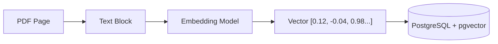
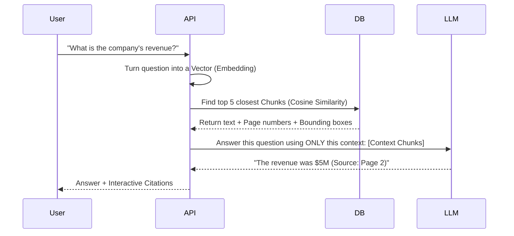

# RAG Engine Guide

This guide explains how the "Brain" of the PDF-RAG system works—how it finds the right information and generates accurate answers.

## What is RAG?

**Retrieval-Augmented Generation (RAG)** is a technique to give an LLM (like GPT-4) access to specific data it wasn't trained on (your PDFs). 

Think of it like this:
- **LLM:** A genius student.
- **RAG:** Giving that student an open-book exam where they can look at your specific PDFs to find the answer.

## The Two-Step Process

### Step 1: Ingestion (The Indexing Phase)
When a PDF is uploaded, we break it into "Chunks" and turn them into "Embeddings".

- **Embedding:** A mathematical "map coordinate" representing the *meaning* of the text.
- **pgvector:** A special database plugin that lets us store these coordinates and find "nearby" ones.

### Step 2: Retrieval (The Q&A Phase)
When you ask a question, the system finds the most relevant chunks and hands them to the LLM.

## How "Search" Works Mathematically

We use **Cosine Similarity**. 
Imagine every chunk of text is an arrow pointing in a specific direction in a massive 1536-dimensional room.
- If two pieces of text are about "Revenue", their arrows point in almost the same direction.
- If one is about "Revenue" and another is about "Cat recipes", their arrows point in very different directions.

The system calculates the **angle** between your question's arrow and all the chunks in your PDF. The smallest angle wins!

## Precision Citations

Unlike many RAG systems, we don't just tell you the page number. Because we saved the **Bounding Box** during indexing, the frontend can draw a box around the exact sentence the AI read.

- **Bounding Box:** `[x0, y0, x1, y1]`
- **Line Numbers:** `15-18`

This creates "Trustworthy AI"—you can verify every claim by looking at the highlighted source.

## Isolation and Security

The RAG engine is **Multi-Tenant**.
- Every search query is restricted by `user_id`.
- You can *never* retrieve a chunk from another user's document, even if their document contains a perfect match for your question.
