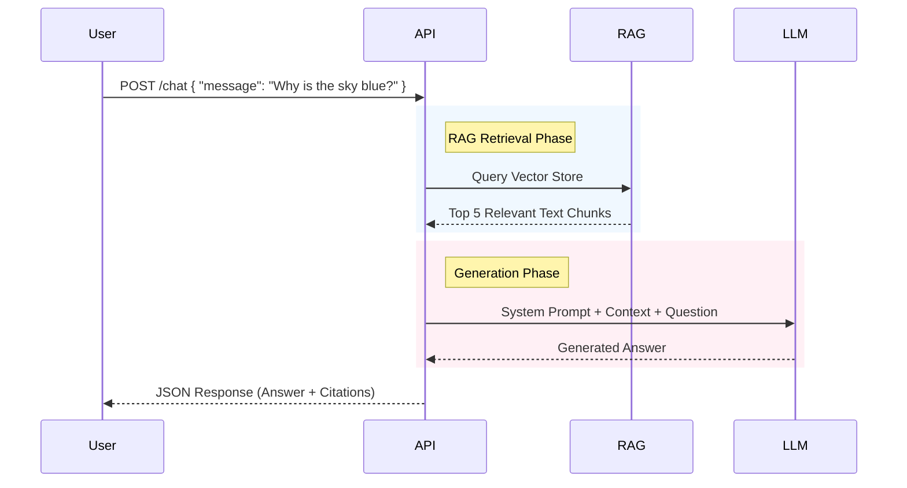

# Chat & Q&A Guide

This guide explains how to interact with the Chat API to build a responsive, trustworthy Q&A experience.

## The Chat Workflow

The Chat API is the primary interface for users to extract value from their uploaded documents. It is **stateless** (RESTful) but built on top of a Retrieval-Augmented Generation (RAG) engine.

#### Flow Diagram: Question to Answer



## Understanding Citations

One of the unique features of this API is the **Citation Object**. We don't just give you an answer; we give you the receipts.

### The Citation Object
Every citation contains:
1.  **`text`**: The raw text snippet the AI used.
2.  **`pageNumber`**: Which page it's on.
3.  **`boundingBox`**: The exact X/Y coordinates on that page.
4.  **`lineStart` / `lineEnd`**: The logical line numbers.

### Visualizing Citations (Frontend)
When you receive a citation, you should use the `boundingBox` to render a highlight overlay on the PDF.

```json
"boundingBox": {
  "x0": 100,  // Left
  "y0": 200,  // Top
  "x1": 300,  // Right
  "y1": 220   // Bottom
}
```

This tells your PDF viewer (like `react-pdf` or `pdf.js`) exactly where to draw the yellow box.

## Single Document vs. Global Chat

The API supports two modes:

1.  **Global Chat (Default):**
    - Searches *all* of the user's "Ready" documents.
    - Useful for "What projects are we working on across the company?"

2.  **Single Document Mode:**
    - Pass `documentId` in the request body.
    - Restricts the vector search to just that one file.
    - Useful for "Summarize this specific contract."
