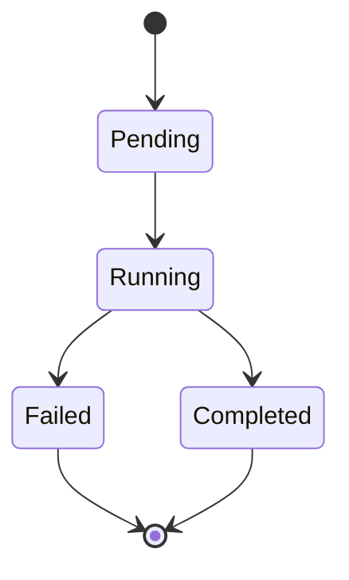
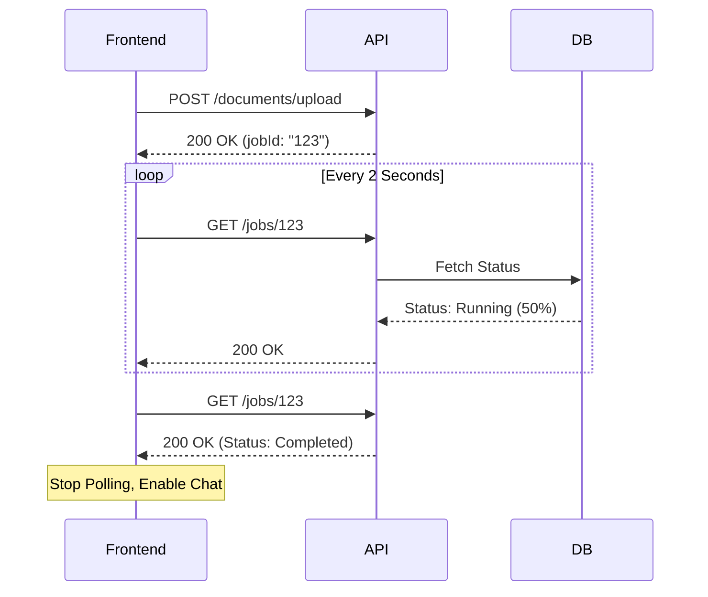

# Job System Guide

This guide explains how to track long-running operations in the PDF-RAG system.

## The Asynchronous Challenge

Processing a PDF involves heavy computation:
1.  Downloading the file.
2.  Parsing text and layout.
3.  Generating embeddings (expensive API calls).
4.  Saving thousands of vectors to the database.

To keep the API fast, we don't do this while the user waits. We create a **Job** and return immediately.

## Tracking Progress

When you upload a document, you receive a `jobId`. You can poll the `/jobs/{jobId}` endpoint to see exactly what's happening.

### Job States

A job moves through a defined lifecycle:

- **Pending:** Queued but not yet started.
- **Running:** Active. Check `progressPercent` (0-100).
- **Completed:** Success. The document is ready.
- **Failed:** Error. Check `errorCode` and `errorMessage`.

### Job Stages

Complex jobs are broken down into **Stages**. This gives granular visibility.

For a `document_upload` job, you might see:
1.  **Stage 1: `parse_pdf`** - Extracting text.
2.  **Stage 2: `chunk_text`** - Splitting into processing units.
3.  **Stage 3: `generate_embeddings`** - Calling AI provider.
4.  **Stage 4: `index_vectors`** - Saving to DB.

This helps debug exactly where a process is stuck or slow.

## Integration Strategy

### Polling vs. Webhooks
Currently, the system uses **Polling**.

**Recommended Frontend Logic:**
1.  Upload File -> Get `jobId`.
2.  Start polling `GET /jobs/{jobId}` every 2 seconds.
3.  If `status === 'running'`, update progress bar.
4.  If `status === 'completed'`, stop polling and show "Ready".
5.  If `status === 'failed'`, stop polling and show error.

#### Flow Diagram: Polling Loop

