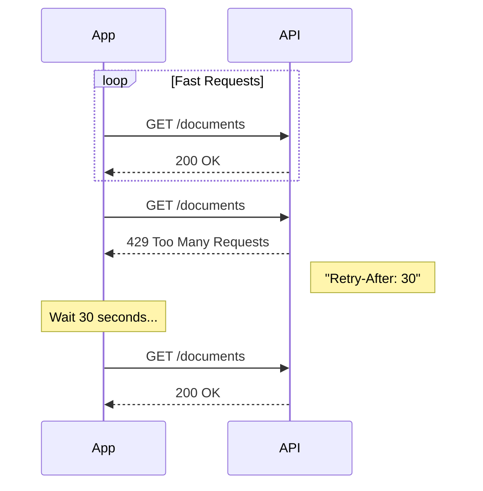

# Infrastructure Guide

This guide explains the "plumbing" that keeps the API running securely and reliably.

## Rate Limiting

To ensure one user cannot crash the system by spamming requests, we use **Rate Limiting**.

### How it works
Imagine a doorman with a counter.
1.  You have a quota of **100 requests per minute**.
2.  Every time you call the API, the counter goes up.
3.  If you hit 101, the door slams shut. You get a `429 Too Many Requests` error.
4.  After 1 minute, your counter resets.

### Handling 429 Errors
If your frontend receives a 429, you should pause and retry later.

## CORS (Cross-Origin Resource Sharing)

Web browsers block your frontend (running on `localhost:3000`) from talking to your backend (on `localhost:8000`) by default for security. **CORS** is the whitelist that allows this communication.

- **Configuration:** You must add your frontend's URL to `CORS_ORIGINS` in the `.env` file.
- **Errors:** If you see "blocked by CORS policy" in your browser console, check this setting.

## Database Management

We use **PostgreSQL** with a super-power: **pgvector**.

### Why PostgreSQL?
- **Relational Data:** Stores Users, Documents, and Jobs reliably.
- **Vector Data:** Stores the "AI brain" data (embeddings) in the *same* database.

This "All-in-One" approach is simpler than managing a separate Vector DB (like Pinecone) + a Relational DB.

### Migrations
When we change the code (e.g., adding a "birthdate" to the User model), the database needs to update. We use **Migrations** to apply these changes safely without deleting existing data.
